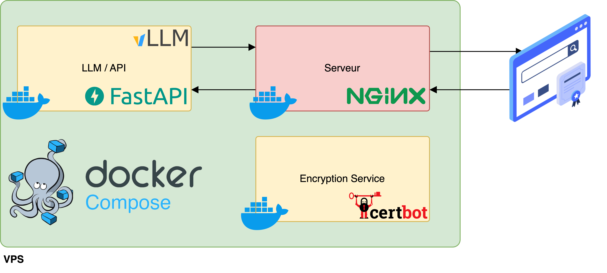

# Test d'une "mini" mise en production d'un LLM

Le présent repo contient un `docker compose` (`compose.yml`) permettant de créer une API d'un LLM sous `FastAPI`, servi par `Nginx` dans un VPS **Hetzner** et dont les différents endpoints peuvent être retrouvés sur le lien suivant : [https://apptest.ovh/docs](https://apptest.ovh/docs).

Il est à noter que cette API reprend les mêmes normes que celles utilisées par **OpenAI** grace à [vLLM](https://blog.vllm.ai/2023/06/20/vllm.html). De ce fait, la documentation de **OpenAI** est valide pour requêter ce serveur et vous pouvez retrouver cette documentation [en cliquant sur ce lien](https://platform.openai.com/docs/quickstart).

## Architecture



## Quelques points techniques

- `vLLM` est plus rapide et efficace pour l'inférence que `transformers` de Hugging Face et contient une intégration d'une API suivant les normes de **OpenAI**.
- Je prévois l'utilisation d'un VPS sans GPU en me basant uniquement sur les CPUs. Malheureusement `vLLM` ne dispose pas d'une image `Docker` prope à une utilisation CPU, par contre il offre un `Dockerfile` de base permettant la création d'une image compatible avec une compilation complète du code et la possibilité de modifier le serveur `FastAPI` inclus par défaut.
- J'ai pu créer ma propre image `Docker` compatible CPU [alemaizi/vllm-cpu](https://hub.docker.com/r/alemaizi/vllm-cpu) en suivant les étapes suivantes :
  - Dans un premier temps il faut cloner le repo de `vLLM` [https://github.com/vllm-project/vllm](https://github.com/vllm-project/vllm).
  - Avant la construction de l'image, il est possible de modifier l'api `FastAPI` définie dans le fichier `vllm/entrypoints/openai/api_server.py`. Il est intéressant de le faire si on souhaite l'implémentation d'un système d'authentification plus robuste avec des requêtes vers une base de données ou tout autre procédure à inclure.
  - La construction de l'image se fait via `Dockerfile.cpu` permettant ainsi de disposer d'une image de `vLLM` compatible avec un processing avec des CPUs.
- Le modèle LLM utilisé est `microsoft/Phi-3-mini-4k-instruct`, c'est un petit modèle avec des performances assez respectables bien suffisant pour réaliser des testes sans nécessité de grandes ressources.
- `nginx/default.conf` contient la configuration du serveur `Nginx` utilisé au niveau du VPS.
- Une configuration du pare-feu a été faite en utilisant `ufw` visant à limiter le traffic à l'utilisation `ssh`, `http` et `https`.

## Docker Compose

```yaml
services:
  fastapi:
    container_name: fastapi
    image: alemaizi/vllm-cpu
    restart: always
    command: --model [nom_du_modele_llm] --api_key [une_cle_api_pour_limiter_l_acces]
  nginx:
    container_name: nginx
    image: nginx
    restart: always
    ports:
      - 80:80
      - 443:443
    volumes:
      - ./nginx/default.conf:/etc/nginx/conf.d/default.conf
      - /etc/letsencrypt:/etc/letsencrypt
      - /var/www/certbot:/var/www/certbot
    depends_on:
      - fastapi
  certbot:
    restart: always
    image: certbot/certbot
    container_name: certbot
    volumes:
      - /etc/letsencrypt:/etc/letsencrypt
      - /var/www/certbot:/var/www/certbot
```

Le `Docker Compose` définit trois services : **fastapi**, **nginx** et **certbot**.

- **fastapi** : ce service permet de lancer `FastAPI` de `vLLM` avec la possibilité de définir le modèle à utiliser via l'argument `--model` ([liste des modèles](https://docs.vllm.ai/en/latest/models/supported_models.html)) ainsi qu'un système d'authentification très basique par le biais de l'argument `--api_key` définissant le token à utiliser.
- **nginx** : c'est le serveur de notre VPS qui recevra les requêtes via `http\https`.
- **certbot** : le service de gestion de l'autorité de cryptage afin de disposer du `https` au niveau du serveur via **Let's Encrypt**.

## Démo d'utilisation de l'API

Initialisation et définitions de base :

```python
# On débute par la définition du token, des endpoints et le header
token = "token_value_for_access"
headers = {"Authorization": f"Bearer {token}"}

base_url = "https://apptest.ovh"
url_models = f"{base_url}/v1/models"
url_completions = f"{base_url}/v1/completions"
url_chat_completions = f"{base_url}/v1/completions"
```

### Disposer de la liste des modèles LLM disponibles

```python
import requests

response = requests.get(url_models, headers=headers)
# on peut très bien gérer l'exception si response.status_code est différent de 200
response.json()
```

```python
# réponse
{'object': 'list',
 'data': [{'id': 'microsoft/Phi-3-mini-4k-instruct',
   'object': 'model',
   'created': 1722780548,
   'owned_by': 'vllm',
   'root': 'microsoft/Phi-3-mini-4k-instruct',
   'parent': None,
   'max_model_len': 4096,
   'permission': [{'id': 'modelperm-d2d75c64b9594a029d66d57ef728d6ea',
     'object': 'model_permission',
     'created': 1722780548,
     'allow_create_engine': False,
     'allow_sampling': True,
     'allow_logprobs': True,
     'allow_search_indices': False,
     'allow_view': True,
     'allow_fine_tuning': False,
     'organization': '*',
     'group': None,
     'is_blocking': False}]}]}
```

### Exemple de complétion de texte

```python
# completion
data = {
    "model": "microsoft/Phi-3-mini-4k-instruct",
    "prompt": "Say this is a test!",
    "max_tokens": 20,
    "temperature": 0,
  }

response = requests.post(url_completions, headers=headers, json=data)
data = response.json()
print(data['choices'][0]['text'])
```

réponse

```text
# Answer
This is a test!
```

### Exemple d'un chat

```python
# Chat
data = {
    "model": "microsoft/Phi-3-mini-4k-instruct",
    "messages": [
      {
        "role": "system",
        "content": "You are a helpful assistant."
      },
      {
        "role": "user",
        "content": "Hello!"
      },
      {
        "role": "assistant",
        "content": "Hello! How can I help you today?"
      },
      {
        "role": "user",
        "content": "What fun activity can I do today?"
      }
    ]
}

response = requests.post(url_chat_completions, headers=headers, json=data)
response.json()
```

```python
# réponse

{'id': 'chat-4ab5eb91ac2a491690be9bed1ca1216e',
 'object': 'chat.completion',
 'created': 1722781791,
 'model': 'microsoft/Phi-3-mini-4k-instruct',
 'choices': [{'index': 0,
   'message': {'role': 'assistant',
    'content': " To come up with a fun activity for today, consider the weather, your interests, and what you have at home. A great idea could be a virtual escape room challenge if you enjoy puzzles and teamwork. You could also try a new recipe for a fun cooking adventure, or go for a nature walk to explore the outdoors. If you're into technology, maybe play a virtual reality game or build a model kit. The key is to pick something that excites you and fits your current environment and resources!",
    'tool_calls': []},
   'logprobs': None,
   'finish_reason': 'stop',
   'stop_reason': 32007}],
 'usage': {'prompt_tokens': 34, 'total_tokens': 145, 'completion_tokens': 111}}
```

### Exemple de streaming d'une réponse d'un chat

```python
# streaming
import json
import requests

data = {
    "model": "microsoft/Phi-3-mini-4k-instruct",
    "messages": [{"role": "user", "content": "What is a pyramid?"}],
    "temperature": 0,
    "stream": True,
}

response = requests.post(url_chat_completions, headers=headers, json=data, stream=True)

with response:
    for chunk in response.iter_lines():
        if chunk:
            chunk_txt = chunk.decode('utf-8')
            if chunk_txt.startswith('data: '):
                json_str = chunk_txt.removeprefix('data: ').strip()
                if json_str == "[DONE]":
                    print("\n[DONE]")
                    break
                try:
                    data = json.loads(json_str)
                    choices = data.get('choices', [])
                    if choices and 'delta' in choices[0]:
                        delta = choices[0]['delta']
                        if 'content' in delta:
                            print(delta['content'], end="", flush=True)
                        elif 'finish_reason' in choices[0] and choices[0]['finish_reason'] is not None:
                            print()  # New line at the end of the response
                            break
                except json.JSONDecodeError:
                    print(f"Error decoding JSON: {json_str}")

response.close()
```

réponse

```text
 A pyramid is a three-dimensional geometric shape that has a polygonal base and triangular faces that converge to a single point called the apex. The most famous pyramids are the Egyptian pyramids, which were built as monumental tombs for pharaohs. The Great Pyramid of Giza is one of the Seven Wonders of the Ancient World. Pyramids can have different base shapes, such as triangles, squares, or other polygons, and the number of triangular faces will correspond to the number of sides on the base.
[DONE]
```

## Étapes suivantes

Le serveur créé présente de nombreuses limitations, bien qu'il est entièrement fonctionnel pour recevoir des requêtes, soit pour des tâches de complétion ou de chat avec un assistant, il ne permet une mise à l'échelle ou une intégration de tâches plus poussées.

Si j'avais à pousser ce projet vers

- Utilisation d'une infrastructure avec des GPUs ou TPUs.
- Intégration d'un système d'authentification plus avancé.
- Utilisation de **[Haystack](https://docs.haystack.deepset.ai/docs/intro)** pour la mise à l'échelle mais surtout la création d'un **RAG** (Retrieval-augmented generation) et des pipelines d'agents. Il est à noter que **Haystack** permet d'intégrer **vLLM** dans ses pipelines.
